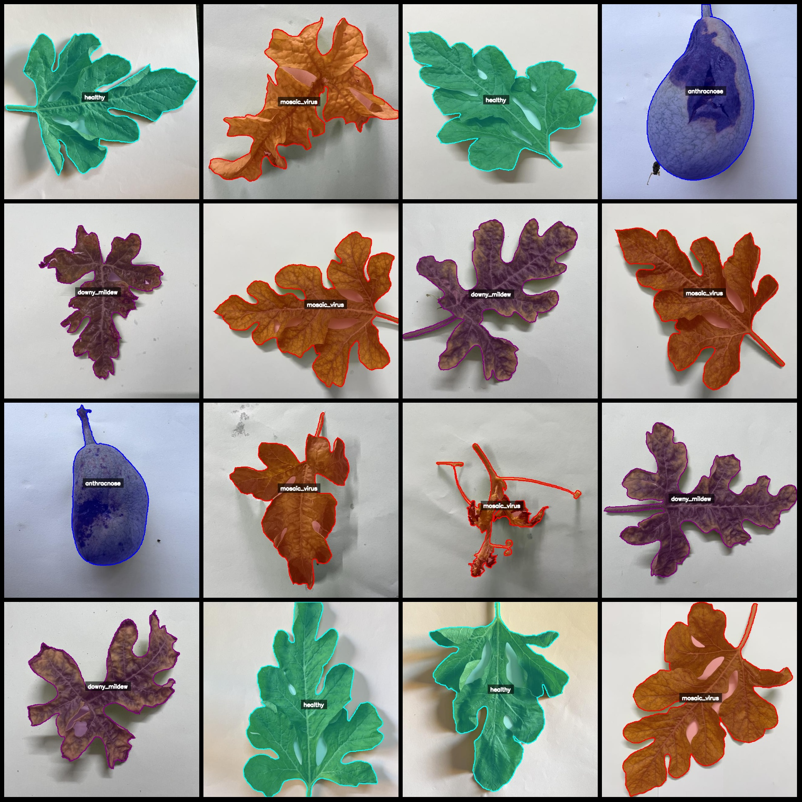
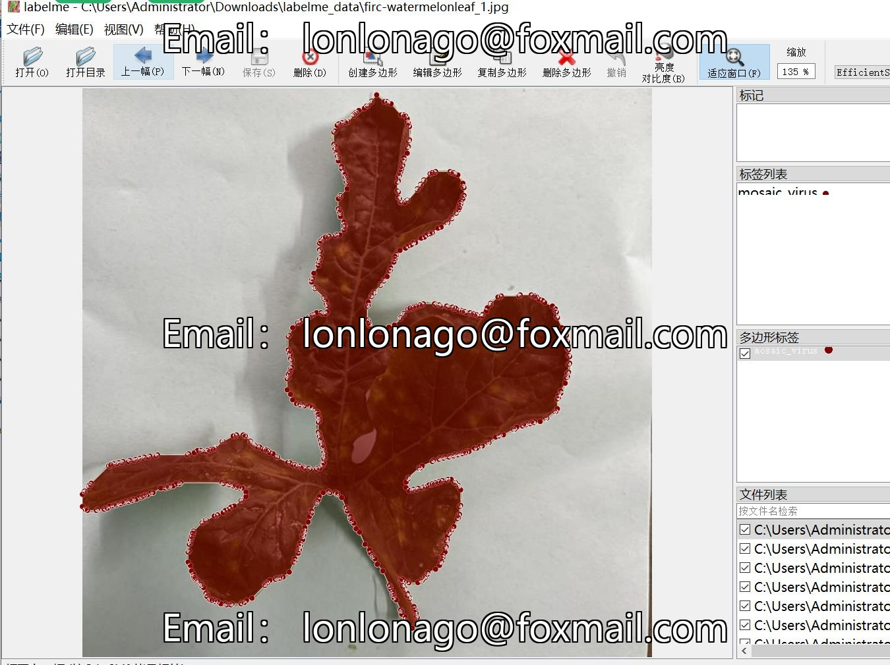

# Melon Leaves Disease Identification and Segmentation Dataset in labelme format with 1738 images and 4 categories

Dataset format: labelme format (excluding mask files, only containing jpg images and corresponding json files)
Number of images (jpg file count): 1738
Number of annotations (json file count): 1738
Number of annotation categories: 4
Annotation category names: ["mosaic_virus", "healthy", "downy_mildew", "anthracnose"]
Number of bounding boxes per category:
mosaic_virus (Cucumber mosaic virus disease) count = 630
healthy (Healthy) count = 298
downy_mildew (Downy mildew) count = 576
anthracnose (Anthracnose) count = 237
Total bounding box count: 1741
Using annotation tool: labelme = 5.5.0
Image resolution: 640x640
Annotation rules: Draw polygons for categories
Important note: This dataset can be opened and edited using labelme, but the json dataset must be converted to either mask or yolo format or coco format for semantic segmentation or instance 
segmentation
Special notice: This dataset does not guarantee the accuracy of the trained model or weight files
Image preview:
Annotation example:
Original image (select 16 images for display):
Annotation drawing results:

## Image

Here is a pay link on Stripe ( https://buy.stripe.com/3cs8yP7sY87d0vu9AB ). Please contact me lonlonago@foxmail.com after funding $89, and I will send you a complete data files , thank you!

